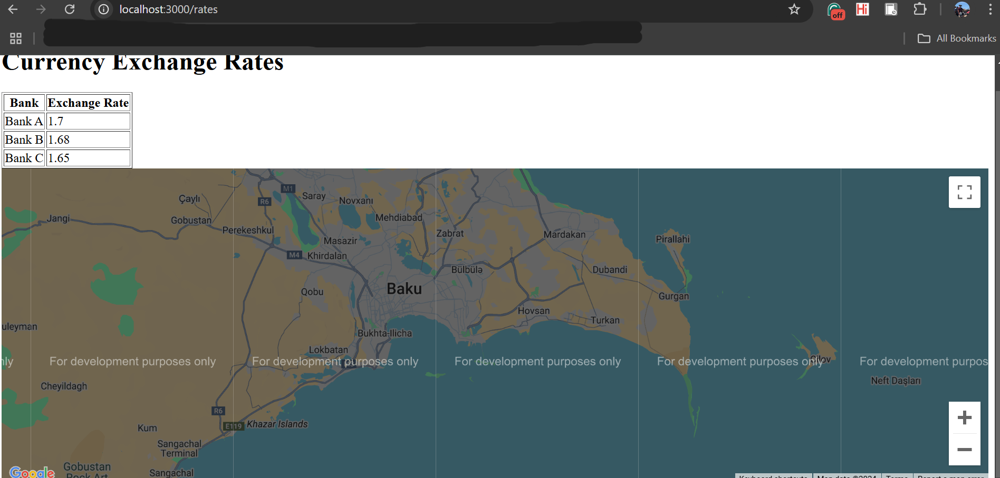

# 1st Iteration

<!-- TOC tocDepth:2..3 chapterDepth:2..6 -->

- [1. Thought Process](#1-thought-process)
- [2. Project Structure](#2-project-structure)
    - [2.1. **Frontend**](#21-frontend)
    - [2.2. **Backend**](#22-backend)
    - [2.3. **Third-Party APIs**](#23-third-party-apis)
    - [2.4. **Tech Stack**](#24-tech-stack)
- [3. Next Iteration](#3-next-iteration)

<!-- /TOC -->

This iteration is focused on creating a basic prototype of the application that allows users to a static geneerated data of exchange rate, have a bilingual interface, and have a basic map that only shows the google api works.

## 1. Thought Process

The insperation for the data stack and the backend is from the midterm project for CM2040 Databses, Networks and the Web.

| **Category**         | **Technology**           | **Description**                                              |
|-----------------------|--------------------------|--------------------------------------------------------------|
| **Backend**          | Node.js                 | Runtime environment for building server-side applications.   |
|                       | Express.js              | Web application framework for routing and HTTP handling.     |
|                       | SQLite                  | Lightweight, file-based SQL database for data storage.       |
| **Frontend**         | EJS                     | Server-side rendering of HTML templates for dynamic content. |
|                       | CSS                     | Stylesheets for visual design using `main.css`.              |
| **Development Tools**| Body-Parser             | Middleware for parsing incoming request bodies (e.g., forms).|
|                       | NPM Scripts            | Custom scripts for managing the app and database operations. |
| **Directory Structure**| Routes                | Separate modules for author, reader, and main routes.        |
|                       | Views                   | EJS templates for different pages (e.g., homepage, settings).|

## 2. Project Structure

### 2.1. **Frontend**
- **Technology**: HTML with EJS (Embedded JavaScript Templates)
- **Functionality**:
  - Display exchange rates in a table.
  - Display a Google Maps component with geolocation centered on Baku.
- **Features Added**:
  - Integration with Google Maps API to show a map.

### 2.2. **Backend**
- **Technology**: Node.js with Express.js framework.
- **Functionality**:
  - Serve dynamic content (exchange rates and translations) via `GET` endpoints.
  - Manage translations using a simple JavaScript file.

### 2.3. **Third-Party APIs**
- **Google Maps API**:
  - Used to embed a map displaying Baku with adjustable zoom and dynamic loading.

### 2.4. **Tech Stack**
| Layer         | Technology                     | Purpose                             |
|---------------|---------------------------------|-------------------------------------|
| **Frontend**  | HTML, EJS                      | Display data, multilingual UI       |
| **Backend**   | Node.js, Express.js            | Serve content, handle routes        |
| **Database**  | None        | Not used yet; future for data storage |
| **APIs**      | Google Maps API                | Map visualization                   |
| **Languages** | JavaScript                     | Backend and frontend functionality  |

## 3. Next Iteration

- Language switcher with links for changing languages.
    - Dynamic, multilingual interface allowing users to switch between English, Russian, and Azerbaijani.
    - Support a route to switch the current language.
- Integration with Google Maps API to show bank locations on the map.

