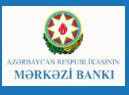

# Source of Data

<!-- TOC tocDepth:2..3 chapterDepth:2..6 -->

- [1. Public APIs or Web Services](#1-public-apis-or-web-services)
- [2. Web Scraping](#2-web-scraping)
   - [2.1. Consolidated Bank List](#21-consolidated-bank-list)
   - [2.2. limited liability companies (llc)](#22-limited-liability-companies-llc)
- [3. FTP Servers or Feeds](#3-ftp-servers-or-feeds)
- [4. Data Aggregators (Portals)](#4-data-aggregators-portals)
   - [4.1. banks.az](#41-banksaz)
   - [4.2. infobank.az](#42-infobankaz)
   - [4.3. MALİYYƏ SAVADLILIĞI Portalı.](#43-mali̇yyə-savadliliği-portalı)
   - [4.4. Mərkəzi Bankı](#44-mərkəzi-bankı)
   - [4.5. Adif](#45-adif)
- [5. Direct Partnerships](#5-direct-partnerships)

<!-- /TOC -->

## 1. Public APIs or Web Services
Many banks provide publicly accessible APIs or web services that share real-time data, such as exchange rates. These APIs allow external platforms to retrieve up-to-date currency information in a structured format (e.g., JSON or XML).
- Cant find any examples
- Finding an API is probably the best case scenario

## 2. Web Scraping
If APIs are not available, the site might use web scraping techniques to extract data directly from the exchange rate pages of bank websites. This involves automated scripts that fetch and parse HTML content to extract relevant data fields.

### 2.2. limited liability companies (llc)

Last night I saw many mmc's (llc) listed on the site but now its only banks so Im not sure what changed. But the best rates were from zuhur mmc but now according to yandex which I think is like yelp here in the states now says its permamently closed. [zuhur mmc review](https://yandex.com/maps/org/136685285119/?ll=49.862877%2C40.386233&z=17)
 

## 3. FTP Servers or Feeds

Some banks may offer currency rate data via FTP servers or syndicated feeds (like RSS or XML). These are periodically updated by the banks.
- Im not sure how this would work, is it a lower tech api?
- This would work if we can find a bank that offers this service. 
   

## 4. Data Aggregators (Portals)
Instead of direct integration with each bank, azn.day.az might use third-party aggregators that collect and consolidate exchange rate data from multiple banks, providing it through a single API or feed.

### 4.1. banks.az
[banks.az](https://banks.az/servisler/valyuta-mezenneleri)

Seems like a very good product might even make our project irrelvant, however the map is not quite right. but we can ellaborate more in market research. more/branches shows a map 
- only shows 
   - Access Bank   
   - Afb bank
   - atb Azer-Turk Bank
   - kapital bank (capital bank)
   - premium bank
   - Turanbank
   - Unibank
   - Yapi Kredi Bank
  
   

[affiliate program](https://banks.az/affiliate-program)

      
### 4.2. infobank.az

- The website dose not load for me. not sure what it does. 
   - Cliking on the logo at the bottom of the banks webpage who use infobank.az takes you to the infobank.az website.
- [linkedin](https://www.linkedin.com/company/infobank-az/)
- **Used by:**
    1. Access Bank
    2. Afb bank
    3. Azerpost
    4. International Bank of Azerbaijan
    5. ASB Azerbaijan Industry Bank
    6. Bank of the Republic
    7. Premium Bank
    8. VTB Bank (Azerbaijan)
    9. Kapital Bank
    10. Rabita Bank
- **Not used by:**
   - (Now its harder to tell becuase it could be used but not posted or noticed by me.)
   1. Pasha Bank

### 4.3. MALİYYƏ SAVADLILIĞI Portalı.

[link](https://bizimpullar.az/)
- First noticed on Turanbank website. might have been used earlier.
   - I am willing to assume if it uses infobank.az they are using this portal as well.
- Im not sure what the deal with these portals are but the links never work.

### 4.4. Mərkəzi Bankı

- cbar is the central bank of Azerbaijan. I thought this was just a link to the cbar website but it appears to be a portal as well. 
   - needs more research
### 4.5. Adif

[link](https://adif.gov.az/)

### Elektran Hokumat portalı (egov)

- is this the same as adif? not looking like it as both are used on the same site.

like infobank, is posted on all these sites. I think its a goverment site for insurance or benefits but im not sure. So I dont think it pertains to our project.

## 5. Direct Partnerships
In some cases, sites like azn.day.az might have direct partnerships with banks, giving them access to proprietary or internal systems that publish exchange rate data.
- I think this is probably the worst case senario if this is how sites like azn.day.az pulls their data at regular intervals. This is becuase it would require a relationship with the bank and they would have to be able to access the banks internal systems.

## Consolidated Bank List

From [azn.day.az](https://azn.day.az/en/) and [azn.az](https://azn.az/)

| index | Bank | Link | Scrape? | Orignal Source | Portal: infobank.az | Portal: MALİYYƏ SAVADLILIĞI Portalı. | Portal: cbar.az | Portal: Adif |
| --- | --- | --- | --- | --- | --- | --- | --- | --- |
| 1 | Access Bank | [link](https://www.accessbank.az/az/) | Easy to scrape, scroll down from home page | both | yes | yes | yes | maybe it says egov |
| 2 | AFB Bank | [link](https://afb.az/) | Easy to scrape, scroll down from home page | both | yes | yes | yes | maybe it says egov |
| 3 | Azerpost | [link](https://www.azerpost.az/) | Easy to scrape, scroll down from home page | azn.day.az | yes |
| 4 | International Bank of Azerbaijan | [link](https://abb-bank.az/) | Easy to scrape, scroll down from home page *no https  | both | yes | yes | not sure | yes
| 5 | ASB Azerbaijan Industry Bank | [link](https://asb.az/) | Might need javascript to load as exchanged rates flash in the top right corner | both | yes |
| 6 | Bank of the Republic |  [link](https://www.bankrespublika.az/)| Easy to scrape, scroll down from home page | azn.day.az (listed as Bank Respublika) | yes | yes | no | egov |
| 7 | Premium Bank | [link](https://www.premiumbank.az/) | Might need javascript to load as exchanged rates flash in the top right corner | both | yes | yes | not sure | not sure |
| 8 | VTB Bank (Azerbaijan) | [link](https://vtb.az/en/personal/) | Easy to scrape, scroll down from home page | azn.az | yes | not sure | not sure | yes and egov |
| 9 | Kapital Bank | [link](https://www.kapitalbank.az/en) | Easy to scrape, scroll down from home page | azn.az | yes | yes | not sure | yes and egov |
| 10 | Pasha Bank | [link](https://www.pashabank.az/lang,en/) | Easy to scrape, scroll down from home page | azn.az | not sure | not sure | not sure | yes |
| 11 | Rabita Bank | [link](https://www.rabitabank.com/) | Easy to scrape, scroll down from home pag  | azn.az (listed as Rabitəbank on azn.day.az) | yes | yes | yes | yes |
| 12 | TuranBank | [link](https://www.turanbank.az/en/pages/1) | Easy to scrape, scroll down from home page | both | yes | yes | yes | yes |
| 13 | Unibank | [link](https://unibank.az/en) | Easy to scrape, scroll down from home page  | both | yes | yes | yes | yes and egov |
| 14 | Yapi Kredi Bank Azerbaijan | [link](https://www.yapikredi.com.az/) | Easy from [dedicated page](https://www.yapikredi.com.az/en/mezenne) | both | yes | yea | not sure | not sure |
| 15 | Bank Melli Iran | [link](https://en.bmibaku.az/) | Easy to scrape, scroll down from home page  | azn.day.az | yes | not sure | not sure | yes and egov |
| 16 | Yelo Bank | [link](https://www.yelo.az/) | checks if human or bot. Easy from [dedicated page](https://www.yelo.az/az/exchange-rates/) | azn.day.az | yes | not sure does include karabakh revival fundation | not sure does include life foundation | yes and egov |
| 17 | Azer Turk Bank | [link](https://atb.az/) | Easy to scrape, scroll down from home page | azn.day.az | Easy to scrape, scroll down from home page | yes | not sure | yes | yes |
| 18 | Express Bank | [link](https://expressbank.az/) | need to click currency rate in the home page no dedicated page | azn.day.az | yes | yes | not sure | yes and egov|
| 19 | Bank BTB | [link](https://btb.az/) | might need javascript to load | azn.day.az | yes | yes | not sure | yes and egov|
| 20 | Ziraat Bank | [link](https://ziraatbank.az/az) | Easy to scrape, scroll down from home page | azn.day.az | yes | yes | not sure | not sure|
