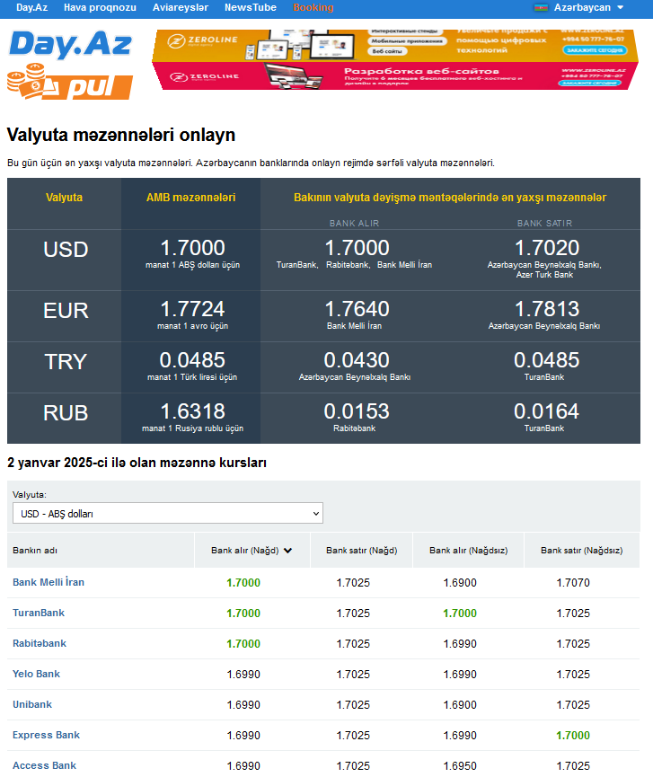
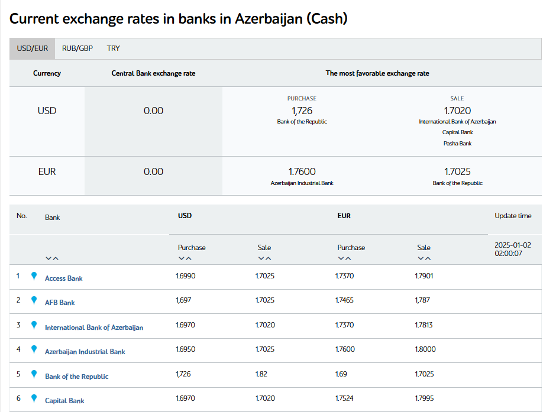
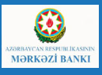
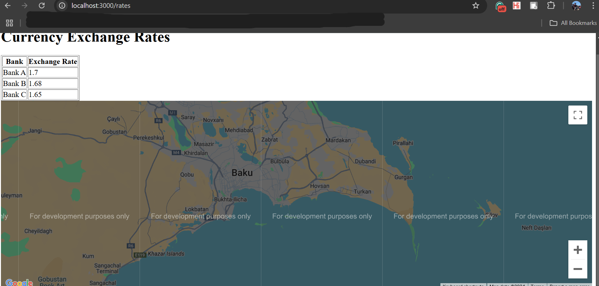
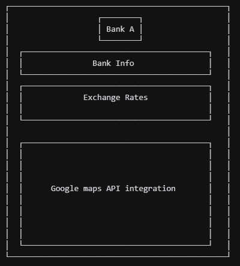
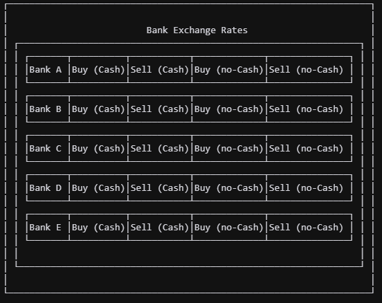

# Currency Convertion Project Report

**A Currency Convertion Visualization Tool for Baku, Azerbaijan**

## 1. Table of Contents
<!-- TOC tocDepth:2..3 chapterDepth:2..5 -->

- [1. Table of Contents](#1-table-of-contents)
- [2. Concept](#2-concept)
- [3. Aims and Objectives](#3-aims-and-objectives)
    - [3.1. Aims](#31-aims)
    - [3.2. Objectives](#32-objectives)
- [4. Stakeholders](#4-stakeholders)
- [5. Product Research](#5-product-research)
    - [5.1. Reason for the project](#51-reason-for-the-project)
    - [5.2. SWOT Analysis](#52-swot-analysis)
    - [5.3. PESTEL Analysis](#53-pestel-analysis)
    - [5.4. Market Research](#54-market-research)
- [6. Technical and Functional Requirements/Specifications](#6-technical-and-functional-requirementsspecifications)
    - [6.1. Source of Data](#61-source-of-data)
    - [6.2. Technical Prototype](#62-technical-prototype)
    - [6.3. Wire Frames](#63-wire-frames)
- [7. Questionnaire](#7-questionnaire)
- [8. Planning](#8-planning)
- [9. References](#9-references)

<!-- /TOC -->

## 2. Concept

The proposed project is an application designed to help users quickly find the best currency exchange rates and the closest bank branches in Azerbaijan, with an initial focus on the city of Baku. The app targets both locals seeking favorable exchange rates and tourists unfamiliar with the local banking landscape. Unlike online banking platforms, this application does not facilitate financial transactions but serves as a convenient tool to compare rates and locate bank branches.

The app’s core functionality relies on data from Azerbaijani banks, which are required to report their exchange rates to the Central Bank. This information, available on platforms such as infobank.az, will be integrated into the app to provide accurate and real-time updates. Additionally, geolocation features will allow users to filter results by proximity, making it easier to find branches nearby offering competitive rates.

This tool aims to address a common challenge faced by users in navigating varying exchange rates and branch locations, particularly in a busy urban setting like Baku. By streamlining access to this information, the application enhances financial decision-making and convenience. The project has significant potential to benefit both locals and tourists while promoting transparency in currency exchange services.

## 3. Aims and Objectives

### 3.1. Aims
Our primary aim is to develop a web-based application tha allows both locals and tourists, to easily identify the best currency exchange rates and locate nearby bank branches in Azerbaijan. By providing real-time, accessible, and accurate information, the application seeks to enhance financial decision-making and convenience in the Baku market.

### 3.2. Objectives
1. Conduct research to validate the necessity and feasibility of the proposed application, using data from `infobank.az` and similar platforms with redundancy plans in case of data unavailability.   
2. Perform market analysis to identify potential competitors and evaluate their strengths and limitations.  
3. Develop an initial prototype that demonstrates key functionalities, such as rate comparison and branch geolocation, with a clear explanation of design decisions.  
4. Conduct usability testing with our local team member to ensure the application meets user needs effectively.  
5. Refine the design and features based on user feedback, ensuring the application meets user needs effectively.  
6. Document the development process with a critical evaluation, addressing challenges, inaccuracies, and areas for future improvement.  
7. Ensure the application adheres to accessibility standards and is scalable for potential expansion beyond Baku in the future.  

## 4. Stakeholders

We have identified two main stakeholder groups: **locals in Baku** and **tourists**. with one other tertiary stakeholder group: **small and medium-sized enterprises (SMEs)**.

At the core are **locals in Baku**, who frequently require currency exchange services for travel, foreign purchases, or occasional financial needs. While the impact of exchange rate fluctuations on this group is moderate—given their primary use of the Azerbaijani manat—the application simplifies the process of finding favorable exchange rates and nearby bank branches. This convenience makes the tool an essential resource for locals seeking quick and reliable exchange services without extensive effort or research. Aditional as we will see later, in cases of financial emergencies, locals will be the first to use the application in hopes to find the best exchange rates and nearby bank branches as quickly as possible. Locals typically speak Azerbaijani as their primary language, with many also fluent in Russian. These two languages are widely used in everyday life, making them essential for any application targeting this demographic. The application must prioritize Azerbaijani and Russian to ensure accessibility and usability for local users seeking efficient currency exchange solutions.

Another critical stakeholder group is **tourists**, who rely heavily on currency exchange services during their visits to Azerbaijan. Tourists are significantly impacted by exchange rate fluctuations, as these directly influence their spending power. They need tools that provide accurate comparisons and convenient access to nearby branches, making this application particularly valuable. They are also targetted by merchants offering inflated exchange rates to tourists. By addressing these needs, the application enhances the travel experience and supports the growing tourism sector in Azerbaijan. Tourists visiting Azerbaijan come from diverse linguistic backgrounds, but many rely on English for communication, especially those from Western countries, as well as Russian-speaking tourists from neighboring regions.

Additionally, **small and medium-sized enterprises (SMEs)**, particularly those involved in international trade, represent another potential stakeholder group. These businesses often face significant exposure to exchange rate fluctuations [1], which can affect their profit margins. While SMEs are not the primary target audience for the application, they may find value in its ability to provide accurate rate comparisons for foreign transactions. This utility can support SMEs in optimizing their exchange strategies and minimizing financial risks.

## 5. Product Research

### 5.1. Reason for the project

This project was conceived to address critical gaps in the current methods of finding currency exchange rates in Baku, Azerbaijan. Existing platforms like [azn.day.az](https://azn.day.az/) and [azn.az](https://azn.az/) are widely used and appreciated for their functionality. These websites allow users to compare exchange rates across multiple banks, update information frequently (e.g., every 10 minutes), and support multiple languages, including Azerbaijani, Russian, and English. These features make them accessible and helpful for both locals and tourists.

However, despite their strengths, these platforms lack certain key functionalities that could significantly enhance the user experience. For instance, they do not provide geolocation features to help users find nearby exchange offices or ATMs. This limitation forces users to rely on manual research, often checking multiple websites and physically visiting offices, which can be inefficient and time-consuming. Additionally, neither platform includes detailed information on transaction limits, office hours, or safety considerations—features that would be especially beneficial for tourists navigating an unfamiliar city.

Our project aims to bridge these gaps by developing a tool that combines the best features of existing platforms with new, user-focused functionalities. By using up-to-date data from [infobank.az](https://infobank.az/) and incorporating geolocation technology, the application will allow users to find the nearest exchange points quickly and efficiently. It will also provide essential details, such as transaction limits, office hours, and safety tips, ensuring that users have all the information they need to make informed decisions.

Tourists, in particular, will benefit from these enhancements. Many avoid using credit cards due to security concerns and rely heavily on cash. Having access to real-time information on nearby exchange offices and their services will alleviate many challenges they currently face. Locals will also benefit from the tool’s ability to streamline the process of finding the best exchange rates, saving time and effort.

In summary, this project addresses an unmet need in the market by combining real-time data aggregation, geolocation, and additional user-centric features. It will not only simplify financial decision-making but also provide a safer, more convenient experience for both locals and tourists in Baku.

### 5.2. SWOT Analysis

#### 5.2.1. Strengths

The platform's strengths lie in its user-centric functionality, which combines real-time exchange rate data with geolocation services to simplify financial decisions. This dual-focused approach is highly appealing to both locals and tourists, addressing their specific needs intuitively. As a web-based application, it ensures accessibility across multiple devices without requiring installation, further enhancing convenience for users. Integration with `infobank.az` provides reliable, real-time updates based on data mandated by the Central Bank, ensuring the platform’s trustworthiness. Additionally, the inclusion of Google Maps API for geolocation and navigation sets this project apart by enabling users to locate nearby exchange offices efficiently, which is a standout feature not commonly available in similar tools.

#### 5.2.2. Weaknesses

However, the project also has notable weaknesses. The team faces challenges related to limited experience in software development, particularly in areas such as managing geolocation APIs, web hosting, and database systems. These gaps in expertise could extend development timelines and necessitate additional resources. Furthermore, the platform relies heavily on `infobank.az` for data, which introduces a dependency risk. Service interruptions, restricted access, or delayed updates could hinder the platform’s functionality. While a contingency plan involving web scraping from bank websites is in place, this fallback is less reliable and requires continuous maintenance.

#### 5.2.3. Opportunities

The project offers significant opportunities to leverage. Azerbaijan’s growing tourism sector creates a rising demand for reliable currency exchange solutions. Tourists, as a key user base, would greatly benefit from enhanced transparency and geolocation features. Small and medium-sized enterprises (SMEs) engaged in cross-border trade represent another potential audience, as the platform can streamline and optimize their currency exchange processes. Beyond Baku, the platform is scalable to other cities in Azerbaijan and potentially internationally to regions with similar needs. Collaborations with local banks, exchange offices, and tourism agencies also provide opportunities to increase visibility and generate revenue through sponsorships or premium listings. 

#### 5.2.4. Threats

Despite its strengths and opportunities, the platform must address several threats. The competitive landscape includes large financial institutions or tech companies with substantial resources that could develop competing tools with broader features. Economic volatility, including fluctuations in exchange rates or unexpected political or economic crises, may impact the relevance and reliability of the platform’s data, especially for international users. Additionally, the collection and management of user location data present privacy risks. Any mishandling of this data could damage user trust and invite regulatory scrutiny, particularly under stringent global data protection standards. 

### 5.3. PESTEL Analysis

#### 5.3.1. Political Factors

Azerbaijan’s declining media freedom presents significant risks for platforms engaging in editorial or public-facing content. Freedom House, a U.S.-based organization monitoring global freedom, reports widespread arrests of journalists and activists in Azerbaijan, leading to self-censorship and restricted expression [2]. 

**Implication:**  
To mitigate our exposure to risks, our platform should avoid social or editorial features and focus on neutral data visualization, ensuring compliance with local regulations while maintaining user trust and operational safety.

#### 5.3.2. Economic Factors

> Google search for "Manat azn to usd max"

##### 5.3.2.1. Introduction to Manat

The Azerbaijani Manat emerged following the country's independence from the Soviet Union, replacing the Soviet ruble as the national currency. [3] In its early years, the Manat maintained remarkable stability, pegged at approximately 0.78 to the US dollar for several years. [4] During this period, President Aliyev proudly declared it "one of the most stable currencies in the world." [5]

##### 5.3.2.2. Economic Theory on Defending Currency Peg

The Manat's peg to the US dollar proved unsustainable due to Azerbaijan's heavy reliance on the oil market. When oil prices collapse, the Manat's fixed exchange rate prevents the Central Bank of Azerbaijan from effectively intervening in the foreign exchange market to stabilize the currency. This dependency on oil means that fluctuations in oil prices directly impact the Manat's value. To maintain the peg, the Central Bank is forced to purchase foreign currency, which rapidly depleted its foreign reserves. If the crisis contiues long enough, the Central Bank will not have enough foreign currency to maintain the peg, and the currency will devalue, which will result in inflation, a crisis in confidance will result, causing holders of azn to panic and sell their azn, causing the currency to drop even more called a flight to quality. [6]

##### 5.3.2.3. Azeri Light Crude Oil Price Impact on Manat

![Oil price for Azeri Light brand from Jan, 2015 to Jan, 2016 (Source: author's chart, Excel). In general, a rash decrease in oil prices negatively affected the economy of Azerbaijan in 2015-2016. The situation was conditioned by the uncertainty in the economic and political environment. This had a critical impact on the activities of the oil companies both in the world and in Azerbaijan Republic during this period in the form of cost savings and cost reduction. When the reserves of the State Oil Fund of the Republic of Azerbaijan (SOFAZ) reached a critical point, the government resorted to a devaluation.](./img/Oil-price-for-Azeri-Light-brand-from-Jan-2015-to-Jan-2016-Source-authors-chart.png)
> Analysis of the Price Change of the Azerbaijani Oil of Azeri Light, using the Monte-Carlo Method in the Conditions of Uncertainty - Scientific Figure on ResearchGate

##### 5.3.2.4. First Crisis: February 2015

The first occurred in February when the currency lost more than a third of its value against the dollar, causing what banking expert Akram Hasanov described as "serious damage to people and entrepreneurs." [5]

In feburary 2015, the Central Bank of Azerbaijan abandoned the currency peg to the US dollar.  [4]

##### 5.3.2.5. Second Crisis: December 2015

The second crisis hit in December when the central bank ceased protecting the Manat's value, resulting in a dramatic 32% drop in a single day. This led to widespread panic, with people rushing to exchange their Manats for dollars, shops closing their doors, and banks imposing strict exchange limits while exchange offices ran out of dollars entirely.

###### Floating Exchange Rate

In the context of currency exchange, a "corridor" refers to a predetermined range within which a central bank aims to keep the exchange rate of a currency, essentially setting a ceiling and floor for how much the currency can fluctuate against other currencies; so, "dropping the exchange rate corridor" means the central bank is no longer actively intervening to keep the currency value within that specific range, allowing it to freely fluctuate based on market forces, which is called a "floating" exchange rate. [6]

##### 5.3.2.6. Return to De Facto Pegging

By 2017, the government implemented significant reforms, dropping the exchange rate corridor and allowing the Manat to float freely. This included removing the 4% trading range restriction and setting a new official rate at 1.7867, the weakest in its history. The reforms also saw an increase in currency conversion limits from $200 to $5,000 per person. 

The overall decline was stark: from 2014 to 2017, the Manat lost approximately 53% of its value, primarily due to the collapse in oil prices, Azerbaijan's main export. This pattern was not unique to Azerbaijan, as similar trends were observed in other oil-dependent economies like Russia and Kazakhstan.

##### 5.3.2.7. Implications

With the Azerbaijani Manat currently operating under a soft peg to the US dollar at a fixed rate of 1.7, there remains an uncertainty surrounding its stability. This system, while currenctly providing stability, in 2023 S&P Anlaysis assumed that the peg will remain until 2026. [9]

> "Nevertheless, in our view, should hydrocarbon prices drop sharply and remain low for a prolonged period, the authorities could consider adjusting the exchange rate. This would help avoid a substantial loss of foreign-currency buffers, similar to the central bank's actions in 2015"
>
> S&P Analysis qouted in “Azerbaijani Manat’s Peg to the US Dollar to Stay Firm until 2026.” by Trend.Az 

In October 2024, the Azerbaijani Ministry of Finance's forecast predicts that the manat's exchange rate will stay at its current level through 2028. [10] Despite this, there is still an uncertainty surrounding the long-term sustainability of the peg.

In a plausible future scenario where oil prices significantly decline, there would likely be another loss of confidence in the Manat. This could lead to another rush by individuals and businesses to exchange their Manats for US dollars, up to the maximum amount allowed by the Central Bank of Azerbaijan (CBA). Such behavior would reflect a flight to safety as people seek to safeguard their wealth against potential currency devaluation. 

This senarios provides a tangible use case for or project to aid in an efficeint and fast way to locate a bank or exchange office to convert azn to usd.

#### 5.3.3. Social Factors

Azerbaijan's demographic landscape and technological adoption present both opportunities and challenges for the implementation of a currency exchange platform. The country boasts a high literacy rate, with approximately 99.78% of individuals aged 15 and above being able to read and write [11]. Internet penetration is also significant, standing at 88% as of 2022 [12].
Additionally, smartphone penetration exceeds 70%, surpassing many European nations [13].
Despite these encouraging statistics, financial literacy remains a concern. Studies indicate that the overall level of financial literacy among students is around 48%, with male students exhibiting higher financial literacy than their female counterparts [14]. This gap suggests a need for educational initiatives to enhance financial understanding across all demographics. Moreover, while urban areas enjoy widespread internet access, rural regions may experience disparities in connectivity and digital literacy. This urban-rural divide could affect the equitable adoption of digital financial services.

##### 5.3.3.1. Implications

The high literacy rate and substantial internet and smartphone penetration in Azerbaijan provide a solid foundation for the adoption of digital platforms like the proposed currency exchange application.

However, the relatively low financial literacy levels necessitate the inclusion of user-friendly features and educational components within the app to assist users in making informed decisions.

Additionally, efforts should be made to ensure that the platform is accessible and functional for users in both urban and rural settings, taking into account potential differences in internet connectivity and digital proficiency.

#### 5.3.4. Technological Factors

Azerbaijan's commitment to digital transformation is evident in initiatives like the Digital Trade Hub, which promotes electronic payments and digital commerce [15]. This shift towards a cashless society aligns with the app's goals of simplifying and streamlining financial processes.

The Azerbaijan's mobile internet infrastructure has grown rapidly, with 4G coverage now available to 94% of the population, and 5G rollout plans in progress [16]. The increasing adoption of 5G technology is expected to enhance mobile internet speeds and reduce latency, offering better user experiences for mobile applications.

The Azerbaijani government has invested significantly in IT education, launching coding programs and tech hubs to nurture local talent [17]. This is fostering an ecosystem that could support the development and maintenance of tech solutions like the currency exchange app.
Additionally, cybersecurity threats, such as phishing attacks and data breaches, are increasing globally and could pose risks to user trust and data protection [18]. Geolocation data is particularly sensitive. Mismanagement of such information can expose users to privacy risks, such as location tracking or profiling by malicious actors. Implementing anonymized geolocation queries (e.g., by rounding location coordinates to a certain range) can reduce the precision of stored data while preserving the app's functionality [19]. 

##### 5.3.4.1. Implications

The widespread mobile internet and smartphone penetration in Azerbaijan provide a strong foundation for the adoption of the currency exchange application. The ongoing digital transformation and government support for tech initiatives create an enabling environment for the app's development and integration. However, rural connectivity challenges and cybersecurity risks must be addressed to ensure equitable access and user trust. Implementing strong geolocation data protection measures could mitigate these concerns.
References

#### 5.3.5. Environmental Factors

Environmental factors play a lesser but still relevant role in the development of a digital platform like the Baku Currency Exchange Rate Finder. While the direct environmental impact of the application is minimal, there are significant considerations regarding transportation and tourism trends.

The app's geolocation feature, which guides users to nearby exchange offices, could encourage efficient travel routes, minimizing unnecessary trips and thereby reducing carbon emissions. This aligns with broader goals of sustainable urban mobility, as highlighted in studies on geolocation and its role in reducing carbon footprints [23]. However, this benefit is contingent on the app's accuracy and real-time updates.

A growing focus on sustainability in tourism is evident globally, including in Azerbaijan, where efforts are being made to adapt tourism practices to environmental concerns [24]. According to the World Tourism Organization (UNWTO), eco-conscious tourism has seen a sharp rise in interest, with travelers actively seeking sustainable services and solutions [25]. Tourists are increasingly prioritizing eco-conscious services and destinations, and the app's digital-first, paperless approach contributes to reducing environmental waste [26]. Positioning the app as an environmentally responsible solution could enhance its appeal to eco-conscious users.

Additionally, climate risks such as floods, heatwaves, or other extreme weather events may affect travel patterns and the reliability of banking infrastructure. These events could disrupt user access to physical exchange offices or banking services [27], underscoring the importance of providing real-time updates to adapt to changing conditions.

#### 5.3.6. Legal Factors

Developing a currency exchange application in Azerbaijan requires adherence to several legal frameworks and considerations:

Azerbaijan’s Law on Legal Protection of Compilations of Data governs the use of publicly available data, including web scraping. Unauthorized scraping of data from bank websites or currency exchange platforms could potentially infringe on intellectual property rights. If proprietary or sensitive data is collected without explicit permission, it may lead to legal challenges. Therefore, the project should prioritize obtaining explicit permissions or licenses from banks and data providers for data usage [28].

Analysis of one of the Bank’s policies reveals that although there is no explicit prohibition of the data scrapping, however generally they prohibit use of the information from their websites [29]. Despite that majority of other banks located in Baku do not expose Terms of Service or Data Privacy policies in English, data scrapping (such as currency rates, branch addresses etc.) legality then is uncertain, and still poses legal risks.

Additionally, the application must ensure it does not inadvertently facilitate unregulated financial transactions, which may contravene laws governing financial services. While the app itself does not handle transactions, its role in connecting users to banks requires clarity in disclaimers and operational transparency.
Implications

##### 5.3.6.1. Implications

To mitigate risks:

Obtain explicit permissions for scraping or accessing bank data to avoid intellectual property violations.

Exclude any suggestion of provision of financial services by our app. If necessary, include disclaimers clearly stating the app’s role as an informational tool, not a financial service provider, to limit liability.

Prioritize user consent and data protection measures to comply with personal data laws and safeguard user trust.

### 5.4. Market Research

Developing the Baku Currency Exchange Rate Finder app requires an understanding of the current market landscape, including available tools, their limitations, and user needs. The following analysis reviews the findings from user questionnaires, evaluates existing platforms in Baku, and compares international equivalents for additional insights.

#### 5.4.1. Current Solutions in Baku

##### 5.4.1.1. Day.az

https://azn.az

A popular news website that aggregates currency exchange rates from various banks in Azerbaijan

Strengths:
Provides basic exchange rate information.
Includes working hours of banks and addresses linked to Google Maps.
Weaknesses:
Lacks geolocation functionality, forcing users to search manually.
No real-time updates for branch availability or transaction limits.
Limited multilingual support (no tourist-friendly interface).

##### 5.4.1.2. Azn.az

Another local aggregator that lists exchange rates.

Unlike Day.az, Azn.az is azn.az lacks any translation to English. The user is left to using their browsers translation feature to offer a aznerbiani to their language. We found Google's Chrome Translate to be the most accurate and reliable translation tool, other browsers like Windows Edge are not able to translate the page.

This page like Day.az lacks any location information, and only provides the exchange rates.

##### 5.4.1.3. Implications

Both existing websites have significant room for improvement in several key areas. Neither platform currently implements geolocation functionality to help users locate nearby exchange offices, which would be a valuable feature for both locals and tourists. Additionally, they lack detailed information about transaction limits that could help users better plan their exchanges. This is particularly problematic for tourists who may avoid credit cards due to security concerns and need to know which exchange offices are open and accessible.

Currently, most people address these limitations through time-consuming manual research, checking multiple websites and physically visiting different exchange offices. This process is highly inefficient, especially when users arrive at offices only to find they are closed or don't offer competitive rates.

These gaps in the current market present clear opportunities for improvement in our application. By aggregating comprehensive data from all banks and exchange offices, implementing geolocation features to help users find the nearest available exchange points, and including practical information such as transaction limits and safety tips, we can create a more useful tool. These enhancements would be particularly valuable for tourists navigating an unfamiliar financial landscape while providing significant benefits to local users as well.

## 6. Technical and Functional Requirements/Specifications

### 6.1. Source of Data

#### 6.1.1. Public APIs or Web Services
Many banks provide publicly accessible APIs or web services that share real-time data, such as exchange rates. These APIs allow external platforms to retrieve up-to-date currency information in a structured format (e.g., JSON or XML).
- Cant find any examples
- Finding an API is probably the best case scenario

#### 6.1.2. Web Scraping
If APIs are not available, the site might use web scraping techniques to extract data directly from the exchange rate pages of bank websites. This involves automated scripts that fetch and parse HTML content to extract relevant data fields.
 

#### 6.1.3. FTP Servers or Feeds

Some banks may offer currency rate data via FTP servers or syndicated feeds (like RSS or XML). These are periodically updated by the banks.
- Im not sure how this would work, is it a lower tech api?
- This would work if we can find a bank that offers this service. 
   

#### 6.1.4. Data Aggregators (Portals)
Instead of direct integration with each bank, azn.day.az might use third-party aggregators that collect and consolidate exchange rate data from multiple banks, providing it through a single API or feed.
 
##### 6.1.4.1. infobank.az

While attempting to access the infobank.az website directly, we found that it does not load properly. However, we discovered that many banks' websites contain the infobank.az logo at the bottom of their pages, which links to the infobank.az website. Through our research and the company's LinkedIn profile, we identified several major banks that utilize infobank.az's services, including Access Bank, Afb bank, Azerpost, International Bank of Azerbaijan, ASB Azerbaijan Industry Bank, Bank of the Republic, Premium Bank, VTB Bank (Azerbaijan), Kapital Bank, and Rabita Bank. Notable exceptions include Pasha Bank, though it has become increasingly difficult to definitively determine which banks do not use the service, as some may utilize it without prominently displaying the logo or partnership.

##### 6.1.4.2. MALİYYƏ SAVADLILIĞI Portalı.

[link](https://bizimpullar.az/)

The MALİYYƏ SAVADLILIĞI Portalı was initially observed on the Turanbank website, though it may have been utilized by other banks prior to this discovery. Based on observed patterns, it appears that banks using infobank.az services likely also integrate with this portal. However, attempts to access the portal's links have been unsuccessful, making it difficult to fully understand its functionality and role in the banking ecosystem.

##### 6.1.4.3. Mərkəzi Bankı

The Central Bank of Azerbaijan (CBAR) serves as the country's central banking institution. While initially appearing to be just a standard website link, further investigation suggests it may function as a data portal as well. Additional research would be needed to fully understand its capabilities and potential integration options.
##### 6.1.4.4. Adif

[link](https://adif.gov.az/)

##### 6.1.4.5. Elektran Hokumat portalı (egov)

While both Adif and egov logos appear on many bank websites, they appear to be separate entities. The egov portal, like infobank, is widely displayed across banking sites and appears to be a government portal for insurance or benefits. However, due to its focus on government services rather than financial data, it likely falls outside the scope of this project's requirements.

#### 6.1.5. Consolidated Bank List

From [azn.day.az](https://azn.day.az/en/) and [azn.az](https://azn.az/)

| index | Bank | Link | Scrape? | Orignal Source | Portal: infobank.az | Portal: MALİYYƏ SAVADLILIĞI Portalı. | Portal: cbar.az | Portal: Adif |
| --- | --- | --- | --- | --- | --- | --- | --- | --- |
| 1 | Access Bank | [link](https://www.accessbank.az/az/) | Easy to scrape, scroll down from home page | both | yes | yes | yes | maybe it says egov |
| 2 | AFB Bank | [link](https://afb.az/) | Easy to scrape, scroll down from home page | both | yes | yes | yes | maybe it says egov |
| 3 | Azerpost | [link](https://www.azerpost.az/) | Easy to scrape, scroll down from home page | azn.day.az | yes |
| 4 | International Bank of Azerbaijan | [link](https://abb-bank.az/) | Easy to scrape, scroll down from home page *no https  | both | yes | yes | not sure | yes
| 5 | ASB Azerbaijan Industry Bank | [link](https://asb.az/) | Might need javascript to load as exchanged rates flash in the top right corner | both | yes |
| 6 | Bank of the Republic |  [link](https://www.bankrespublika.az/)| Easy to scrape, scroll down from home page | azn.day.az (listed as Bank Respublika) | yes | yes | no | egov |
| 7 | Premium Bank | [link](https://www.premiumbank.az/) | Might need javascript to load as exchanged rates flash in the top right corner | both | yes | yes | not sure | not sure |
| 8 | VTB Bank (Azerbaijan) | [link](https://vtb.az/en/personal/) | Easy to scrape, scroll down from home page | azn.az | yes | not sure | not sure | yes and egov |
| 9 | Kapital Bank | [link](https://www.kapitalbank.az/en) | Easy to scrape, scroll down from home page | azn.az | yes | yes | not sure | yes and egov |
| 10 | Pasha Bank | [link](https://www.pashabank.az/lang,en/) | Easy to scrape, scroll down from home page | azn.az | not sure | not sure | not sure | yes |
| 11 | Rabita Bank | [link](https://www.rabitabank.com/) | Easy to scrape, scroll down from home pag  | azn.az (listed as Rabitəbank on azn.day.az) | yes | yes | yes | yes |
| 12 | TuranBank | [link](https://www.turanbank.az/en/pages/1) | Easy to scrape, scroll down from home page | both | yes | yes | yes | yes |
| 13 | Unibank | [link](https://unibank.az/en) | Easy to scrape, scroll down from home page  | both | yes | yes | yes | yes and egov |
| 14 | Yapi Kredi Bank Azerbaijan | [link](https://www.yapikredi.com.az/) | Easy from [dedicated page](https://www.yapikredi.com.az/en/mezenne) | both | yes | yea | not sure | not sure |
| 15 | Bank Melli Iran | [link](https://en.bmibaku.az/) | Easy to scrape, scroll down from home page  | azn.day.az | yes | not sure | not sure | yes and egov |
| 16 | Yelo Bank | [link](https://www.yelo.az/) | checks if human or bot. Easy from [dedicated page](https://www.yelo.az/az/exchange-rates/) | azn.day.az | yes | not sure does include karabakh revival fundation | not sure does include life foundation | yes and egov |
| 17 | Azer Turk Bank | [link](https://atb.az/) | Easy to scrape, scroll down from home page | azn.day.az | Easy to scrape, scroll down from home page | yes | not sure | yes | yes |
| 18 | Express Bank | [link](https://expressbank.az/) | need to click currency rate in the home page no dedicated page | azn.day.az | yes | yes | not sure | yes and egov|
| 19 | Bank BTB | [link](https://btb.az/) | might need javascript to load | azn.day.az | yes | yes | not sure | yes and egov|
| 20 | Ziraat Bank | [link](https://ziraatbank.az/az) | Easy to scrape, scroll down from home page | azn.day.az | yes | yes | not sure | not sure|

### 6.2. Technical Prototype

The first iteration focused on developing a basic prototype application that provides users with static generated exchange rate data, a bilingual interface, and a basic map demonstrating Google API functionality.

The development team drew inspiration for the data stack and backend architecture from the CM2040 Databases, Networks and the Web midterm project. They structured the technical components as follows:

| **Category**         | **Technology**           | **Description**                                              |
|-----------------------|--------------------------|--------------------------------------------------------------|
| **Backend**          | Node.js                 | Runtime environment for building server-side applications.   |
|                       | Express.js              | Web application framework for routing and HTTP handling.     |
|                       | SQLite                  | Lightweight, file-based SQL database for data storage.       |
| **Frontend**         | EJS                     | Server-side rendering of HTML templates for dynamic content. |
|                       | CSS                     | Stylesheets for visual design using `main.css`.              |
| **Development Tools**| Body-Parser             | Middleware for parsing incoming request bodies (e.g., forms).|
|                       | NPM Scripts            | Custom scripts for managing the app and database operations. |
| **Directory Structure**| Routes                | Separate modules for author, reader, and main routes.        |
|                       | Views                   | EJS templates for different pages (e.g., homepage, settings).|

The project structure was organized into several key components. For the frontend, the team implemented HTML with EJS (Embedded JavaScript Templates) to display exchange rates in a table format and integrate a Google Maps component centered on Baku. The backend was built using Node.js with the Express.js framework to serve dynamic content through GET endpoints and manage translations via JavaScript files. The Google Maps API was incorporated as a third-party service to provide map visualization capabilities.

The complete technology stack was organized as follows:

| Layer         | Technology                     | Purpose                             |
|---------------|---------------------------------|-------------------------------------|
| **Frontend**  | HTML, EJS                      | Display data, multilingual UI       |
| **Backend**   | Node.js, Express.js            | Serve content, handle routes        |
| **Database**  | None        | Not used yet; future for data storage |
| **APIs**      | Google Maps API                | Map visualization                   |
| **Languages** | JavaScript                     | Backend and frontend functionality  |

For the next iteration, the development team plans to implement a language switcher with links for changing languages, enabling a dynamic multilingual interface that supports English, Russian, and Azerbaijani. They also aim to enhance the Google Maps integration to display bank locations on the map.

### 6.3. Wire Frames

#### 6.3.1. Iteration 1

The first iteration's wireframe for the home page focuses on providing a clear overview of exchange rates across multiple banks in Baku. The design follows a tabular layout similar to existing platforms like azn.day.az and azn.az, but with improvements for clarity and usability.

The main interface displays a comprehensive table showing exchange rates for multiple banks. For each bank, the table includes:

- Bank name for clear identification
- Buy and sell rates for cash transactions
- Buy and sell rates for non-cash (card/electronic) transactions

This layout allows users to quickly compare rates across different banks at a glance. The table format was chosen because:

1. It provides a familiar interface that users already understand from existing platforms
2. It enables easy scanning and comparison of rates across multiple banks
3. It efficiently uses screen space to display a large amount of numerical data

The wireframe demonstrates how the application will present essential information without overwhelming users. Each row represents a different bank, with columns clearly labeled for different transaction types. This organization helps users quickly find the most favorable rates for their specific needs, whether they're looking for cash or non-cash transactions.

The design prioritizes readability and ease of comparison, addressing a key user need identified in our market research - the ability to efficiently compare rates across multiple banks without needing to visit multiple websites or locations.

A second wireframe shows the individual bank view, which will be accessible when users click on a specific bank. This detailed view includes:

- Bank name and branding
- Detailed bank information
- Current exchange rates
- Google Maps integration showing branch locations

The second iteration's wireframe for the individual bank view focuses on providing a detailed view of a specific bank's exchange rates and location. The design includes:

- Bank name and branding
- Detailed bank information
- Current exchange rates
- Google Maps integration showing branch locations

## 7. Questionnaire

## 8. Planning

Effective project planning is crucial for ensuring that all team members are aligned and that the project progresses smoothly. For our project, we utilized slack for communication and GitHub for project management.

In the begging our team members ranged from the Central Europe, Western Asia, Eastern Asia, and North America. Thus we deemed the difficulty in finding a common time for a weekly Zoom or Discord meeting would be insurmountable. We thus opted for the more flexible approach, using Slack for communication. 

This provided convience but at the exspence of a more structured approach. In the end this proved to be a problem as we had trouble keeping track of our tasks and progress.

We also lost afew team memebers durring the project. One of the members never enaged thoughout the project, and another was actualy in the wrong team.

We established a dedicated channel, team-35-tutor-group-8_cm2020, to centralize all project-related discussions. This channel was created on November 11th, 2024, and served as the primary hub for communication among team members.

We created a GitHub project to track and assign issues. This allowed us to manage tasks effectively, ensuring that each team member was aware of their responsibilities and the project's status.

Using the GitHub project we created a timeline for the project. This timeline was used to allocate time effectively across different project phases. While we occasionally exceeded our estimated time frames, the flexibility in our planning allowed us to adjust as needed based on the depth of research required.

Our GitHub repository served as the central hub for all project-related documents and code. The repository was organized into several key sections:

- **Concept and Aims**: Documented two weeks ago, outlining the project's objectives and goals
- **Stakeholder Analysis**: Completed two weeks ago, including a comprehensive SWOT analysis
- **Product Research**: Compiled up to social factors, with updates as recent as five hours ago
- **Technical and Functional Specifications**: Wireframes for both the main page and bank info page were completed last week
- **Final Report**: The PESTEL analysis was fully integrated into the final report five hours ago

## 9. References

1. The Trade Finance Guide, U.S. Department of Commerce, www.trade.gov/sites/default/files/2022-07/Trade_Finance_Guide_2022.pdf. Accessed 5 Dec. 2024. 
2. “Azerbaijan: Freedom on the Net 2024 Country Report.” Freedom House, freedomhouse.org/country/azerbaijan/freedom-net/2024. Accessed 23 Dec. 2024.
3. Azerbaijani Manat. (2024, November 12). In Wikipedia. https://en.wikipedia.org/wiki/Azerbaijani_Manat
4. Bagirova, Nailia. “Azeri Central Bank Abandons Currency Peg to U.S. Dollar | Reuters.” Azeri Central Bank Abandons Currency Peg to U.S. Dollar, Reuters, 16 Feb. 2015, www.reuters.com/article/markets/azeri-central-bank-abandons-currency-peg-to-us-dollar-idUSL5N0VQ2KA/. 
5. Viner, Katharine. “Azerbaijan in Crisis as Currency Plummets.” The Guardian, Guardian News and Media, 22 Dec. 2015, www.theguardian.com/world/2015/dec/22/azerbaijan-currency-plummets-oil-price#:~:text=Azerbaijan’s%20currency%20has%20plummeted%20after,face%20of%20falling%20oil%20prices. 
6. Ganti, Akhilesh. “Currency Pegging: Overview and Pros and Cons.” Investopedia, Investopedia, www.investopedia.com/terms/p/pegging.asp. Accessed 4 Dec. 2024. 
7. “Forex Trading Glossary: Forex Terms: Fibo Group: Corridor.” What Is “Corridor” | Definition and Meaning of the Term | Forex Trading Glossary, www.fibogroup.com/products/clients/glossary/corridor/#:~:text=Definition%20and%20Properties:%20A%20corridor%20is%20defined,stability%20while%20limiting%20movements%20on%20the%20market. Accessed 4 Dec. 2024. 2
8. Analysis of the Price Change of the Azerbaijani Oil of Azeri Light, using the Monte-Carlo Method in the Conditions of Uncertainty - Scientific Figure on ResearchGate. Available from: https://www.researchgate.net/figure/Oil-price-for-Azeri-Light-brand-from-Jan-2015-to-Jan-2016-Source-authors-chart_fig1_355364238 [accessed 5 Dec 2024]
9. Gasimov, Kamran. “Azerbaijani Manat’s Peg to the US Dollar to Stay Firm until 2026.” Trend.Az, 10 June 2023, en.trend.az/business/3760007.html. 
10. Gasimov, Kamran. “Azerbaijani Manat to Maintain Constant Value versus US Dollar till 2028.” Trend.Az, 18 Oct. 2024, en.trend.az/business/finance/3958753.html. 
11. "Literacy rate in Azerbaijan 2023." Statista, www.statista.com/statistics/572577/literacy-rate-in-azerbaijan/. Accessed 28 Dec. 2024.
12. "Individuals using the Internet (% of population) - Azerbaijan." World Bank, data.worldbank.org/indicator/IT.NET.USER.ZS?locations=AZ. Accessed 28 Dec. 2024.
13. "Azerbaijan overtakes many European countries in smartphone penetration." Report News Agency, report.az/en/finance/mastercard-azerbaijan-overtakes-many-european-countries-in-smartphone-penetration/. Accessed 28 Dec. 2024.
14. "Demographic Analysis of Financial Literacy Level in Azerbaijan." Universal Journal of Accounting and Finance, www.hrpub.org/download/20210530/UJAF5-12217266.pdf. Accessed 28 Dec. 2024.
15. "Digital Trade Hub of Azerbaijan." E-Government Azerbaijan, www.e-gov.az/en. Accessed 28 Dec. 2024.
16. "Azercell 5G" Azercell, https://www.azercell.com/en/personal/plans-and-services/5g.html. Accessed 28 Dec. 2024.
17. "Cybercrime To Cost The World $10.5 Trillion Annually By 2025." Cybersecurity Ventures, cybersecurityventures.com/hackerpocalypse-cybercrime-report-2016/. Accessed 28 Dec. 2024.
18. "Protecting Privacy in Location-Based Services." IEEE, https://ieeexplore.ieee.org/document/9133462. Accessed 28 Dec. 2024.
19. "Digital Trade Hub of Azerbaijan." E-Government Azerbaijan, www.e-gov.az/en. Accessed 28 Dec. 2024.
20. "Azercell 5G" Azercell, https://www.azercell.com/en/personal/plans-and-services/5g.html. Accessed 28 Dec. 2024.
21. "Cybercrime To Cost The World $10.5 Trillion Annually By 2025." Cybersecurity Ventures, cybersecurityventures.com/hackerpocalypse-cybercrime-report-2016/. Accessed 28 Dec. 2024.
22. "Protecting Privacy in Location-Based Services." IEEE, https://ieeexplore.ieee.org/document/9133462. Accessed 28 Dec. 2024.
23. "Carbon Footprint and Travel Efficiency: The Role of Geolocation Apps in Sustainable Urban Mobility." Sustainable Development Journal, 2023. Available at: sdjournal.org/articles/geolocation-carbon-footprint. Accessed 28 Dec. 2024.
24. "Tourism and Climate Change: Impacts and Adaptation in Azerbaijan." Azerbaijan Tourism Board, tourismboard.az/climate. Accessed 28 Dec. 2024.
25. "Eco-Conscious Tourism Trends 2024." World Tourism Organization (UNWTO), www.unwto.org/eco-tourism-trends. Accessed 28 Dec. 2024.
26. "Paperless Solutions in Modern Applications: Reducing Environmental Impact." Green Tech Insights, www.greentechinsights.com/paperless-digital-solutions. Accessed 28 Dec. 2024.
27. "Impact of Extreme Weather on Banking and Financial Services." Financial Resilience Institute, www.financialresilience.org/research/weather-impact-on-banking. Accessed 28 Dec. 2024.
28. "Law on Legal Protection of Compilations of Data." Azerbaijan Patent and Trademark Office, www.copat.gov.az/docs/Qanunvericilik/Qanunlar/English/Law-Database.pdf. Accessed 28 Dec. 2024.
29. “Terms of use” PASHA Bank, inc., https://www.pashabank.az/static,25/lang,en/. Accessed 28 Dec. 2024.